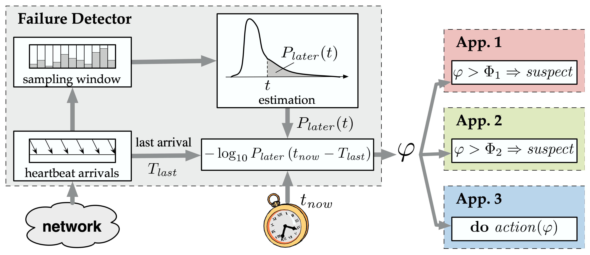
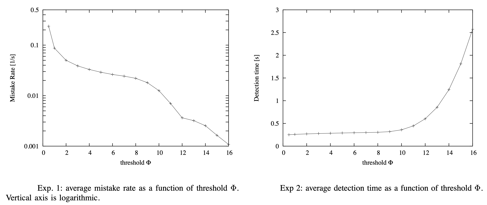

# Real-Time ZeroMQ Library

This project aims to transform the popular messaging library, [*ZeroMQ*](https://zeromq.org), into a real-time library
suitable for applications
requiring guaranteed performance and low latencies. The primary focus is on
the [pub/sub pattern](https://zguide.zeromq.org/docs/chapter5/) of *ZeroMQ*.

## Objectives

1. **Real-Time Transformation**: Modify the underlying architecture of ZeroMQ to make it suitable for real-time
   applications.
2. **Multi-threaded Testing**: Assess the performance and robustness of the library in a multi-threaded environment.
3. **Performance Benchmarking**: Compare the performance of the original ZeroMQ library with the real-time version using
   a series of benchmarks.

## Installation

The document that describes the installation process can be found [here](docs/INSTALLATION.md).

## Enhancements

Here are some of the enhancements made to the library:

- **UDP Communication Protocol**: Switched to UDP for a lighter, faster communication protocol suitable for real-time
  applications.
- **Quality of Service (QoS) Settings**: Implemented various QoS levels to evaluate their impact on latency, packet
  loss, and
  real-time communication reliability.
- **Dynamic Scaling**: Added the ability to dynamically scale the number of threads or processes depending on the
  machine's
  workload. This enhancement is critical in measuring its effect on performance and latency.

## Benchmarks

Performance is assessed using the following benchmarks:

1. **Latency**: A bar chart comparing latency under different workloads (e.g., messages per second). It's crucial to see
   how
   latency varies with workload intensity. In the context of real-time systems, understanding and optimizing latency is
   paramount for several reasons:

    - **Predictability and Consistency**: Real-time systems often require operations to be executed within a strict time
      frame.
      High or variable latency can lead to unpredictability, which is unacceptable in environments where timing is
      critical, such as financial services or emergency response systems.
    - **Quality of Service (QoS)**: In messaging systems, the quality of service is often defined by how fast and
      reliably messages are delivered.
      Latency metrics, especially the **standard deviation** of latency, provide insights into the network's performance
      consistency. A low standard deviation indicates a reliable system with generally predictable latency, whereas a
      high standard deviation might signal intermittent network issues or potential bottlenecks.
    - **Real-time Performance Insights**: The **95th percentile latency** is particularly important in real-time
      systems. It shows the maximum latency experienced by 95% of the messages, excluding outlying delays caused by
      exceptional conditions. This metric helps stakeholders understand the system's performance under normal
      conditions, ensuring that the vast majority of operations meet the required time constraints.
      By focusing on these latency-related metrics, stakeholders can make informed decisions about potential
      optimizations, understand the real-world performance of the system, and ensure that it meets the stringent
      requirements of real-time operations.

2. **Throughput**: A line graph illustrating messages handled per second by the original library vs. the real-time
   version over
   time.
3. **Jitter**: A measure of latency variability. A box plot is used to compare the jitter distribution between the two
   versions.
4. **Resource Usage**: Bar charts contrasting CPU, memory, and other resource usages between the original and real-time
   versions.
5. **Guaranteed Response Times**: In real-time environments, it's essential to know the percentage of cases where a
   message is
   processed within a specific time. Pie charts or histograms are used for visualization.
6. **Reliability Response**: Testing the robustness of the two versions under different stress conditions, visualized
   using bar
   or line charts.
7. **Cumulative Latency Graph**: This graph shows the percentage of requests completed within a particular time frame,
   helping
   to compare the real-time version's performance against the original for prolonged processing requests.

## Scheme of the Project

- **TCP** is the default protocol used by ZeroMQ.
  client and server nodes communicate using TCP sockets.

- **UDP** is the protocol used by the real-time version implemented in this project.
  client and server nodes communicate using UDP sockets.

### Client-Server Communication

client (publisher) sends messages to the server (subscriber) using a **TCP** or **UDP** socket.

- Client threads
    - PUBLISHER socket (`ZMQ_PUB`/`ZMQ_RADIO`) (for sending messages to the server)
    - RESPONDER socket (`ZMQ_SUB`/`ZMQ_DISH`) (for checking received messages from the server)
    - TIMEOUT socket (`ZMQ_RCVTIMEO`/`ZMQ_SNDTIMEO`)
- Server threads
    - SUBSCRIBER socket (`ZMQ_SUB/ZMQ_DISH`) (for receiving messages from client)
    - RESPONDER socket (`ZMQ_REP`)

## QoS Levels Implementation

In the context of the project, ensuring Quality of Service (QoS) is paramount, especially with real-time applications
where the integrity and timely delivery of every piece of data can be critical. The switch from TCP to UDP, while
advantageous in terms of latency and throughput, introduces challenges primarily related to the reliability of data
transmission. UDP, by its very nature, does not guarantee the delivery of packets, and there is no built-in mechanism
for acknowledging the receipt of data or for retransmission in the case of packet loss.
This inherent unreliability of UDP necessitates the incorporation of advanced strategies within the real-time ZeroMQ
library to ensure that the Quality of Service (QoS) is not compromised. Therefore, an innovative approach has been
adopted in this project to mitigate the risk of packet loss in UDP communications, enhancing the protocol's stability
and reliability.

### Overview of QoS Levels

One of the pivotal enhancements made in the realm of QoS is the integration of the
**[Phi Accrual Failure Detector algorithm
](https://www.researchgate.net/publication/29682135_The_ph_accrual_failure_detector)**.
This algorithm, originally conceived for distributed systems to detect
node failures, has been ingeniously repurposed in this context to address the issue of packet loss within UDP
communications.

The Phi Accrual Failure Detector operates on the principle of calculating the 'suspicion' or likelihood that a packet
loss has occurred. Unlike traditional failure detectors that provide a binary (alive/suspected) status, the φ accrual
failure detector offers a more nuanced view by outputting a continuous value representing the likelihood that a
monitored process has crashed.
It does this by evaluating the inter-arrival times of packets and, using these, computes a phi
value that reflects the probability of a packet loss incident. When the phi value exceeds a certain threshold, the
algorithm infers that a packet has likely been lost.

  
<b>Failure Detector</b>

    

In the implementation within the real-time ZeroMQ library, this mechanism plays a crucial role in maintaining QoS in
several ways:

1. **Packet Loss Detection and Notification**: The primary function of the Phi Accrual Failure Detector in this setting
   is to reliably detect instances of potential packet loss. Upon detection, it triggers notifications to the pertinent
   system components, thereby invoking immediate remedial action.
2. **Threshold Configuration**: The algorithm allows for dynamic adjustment of the phi threshold, based on the
   current network conditions and the application's tolerance for packet loss.
3. **Augmented Reliability through Retransmission**: The Phi Accrual Failure Detector mechanism is crucial
   for the implementation of advanced retransmission strategies to ensure the reliable delivery of data.

### Heartbeat-Based Implementation

The φ accrual failure detector relies on periodic "heartbeat" messages sent by monitored processes to signal their
aliveness. Each process sends heartbeats at regular intervals ($`∆_i`$), and the monitoring process expects to receive
these heartbeats within a certain timeout period ($`∆_to`$). Failure to receive a heartbeat within this timeframe
raises the suspicion level for the monitored process.

### Accrual Detection

The real power of the `φ` accrual failure detector lies in its sophisticated treatment of the heartbeats' inter-arrival
times. It maintains a sliding window of the recent heartbeats' arrival times and uses this data to estimate a
statistical distribution of expected heartbeat arrivals. The `φ` value is then calculated based on the probability
that a new heartbeat should have arrived given the historical distribution, but has not. Specifically, `φ` is computed
as:  
$`\phi(t_{\text{now}}) \stackrel{\text{def}}{=} -\log_{10}\left( P_{\text{later}}(t_{\text{now}} - T_{\text{last}}) \right)`$

_Here, `Plater(t)` represents the probability of a heartbeat arriving later than time `t` based on the historical
inter-arrival time distribution. A higher `φ` value indicates a higher suspicion that the monitored process has
crashed._

In simpler terms, the `φ` value helps us determine how likely it is that we've made an incorrect assumption about a
process being down when it might just be delayed. For example, if we set a certain limit, let's say `φ = 1`, and decide
to suspect a process of failure when `φ` reaches or exceeds this limit, there's roughly a 10% chance we could be
wrong—meaning, a late heartbeat could eventually arrive to prove the process is still alive. Similarly, if we adjust
the limit to `φ = 2`, the chance of being mistaken drops to about 1%. With `φ = 3`, the error probability reduces
further to around 0.1%. The pattern continues in this manner, with the likelihood of error shrinking as the `φ`
threshold increases.

### Threshold Adjustment

The `φ` threshold can be adjusted based on the current network conditions and the application's tolerance
for packet loss. For example, if the network is experiencing intermittent packet loss, the threshold can be increased
to reduce the likelihood of false positives. Similarly, if the application can tolerate a certain amount of packet
loss, the threshold can be adjusted accordingly. Choosing the optimal `φ` threshold is a critical decision.   
The authors of the original paper provide insights through **Exp. 1** and **Exp. 2**.  
Briefly, **Exp. 1** showcases how the mistake rate fluctuates with varying `φ`
threshold using the φ failure detector, while **Exp. 2** illustrates the change in detection time. Both figures give
valuable insights into how the choice of the `φ` threshold impacts the performance of the φ failure detector in terms
of mistake rate and detection time.

  
<b>Threshold Experiments</b>

    

---

## The Increasing Timeout Algorithm

The "Increasing Timeout" algorithm is an integral component of the heartbeat-based failure detection mechanism.
This algorithm, specifically designed for distributed systems, continually adjusts the timeout interval to accommodate
varying network conditions, enhancing the reliability of failure detection.

### Steps of the Algorithm

1. **Heartbeat Sampling**:
   Every heartbeat message from the monitored process (`p`) is tagged with a sequence number. The monitoring
   process (`q`) maintains these heartbeat arrival times within a fixed-size sampling window `WS`. Arrival intervals are
   computed from this window, and to maintain the mean `μ` and variance `σ^2`, the sum and sum of squares for all
   samples in the window are tracked.
2. **Distribution Estimation and φ Computation**:
   Inter-arrival times are believed to be normally distributed. The distribution parameters are deduced from the
   sampling window, extracting the mean `μ` and variance `σ^2` from samples. The probability $`P_{later}(t)`$ which
   signifies the likelihood that a heartbeat will be delayed by over t time units from its predecessor is computed using
   the formula below:  
   $`P_{later}(t) = \frac{1}{\sigma\sqrt{2\pi}} \int_{t}^{+\infty} e^{-\frac{(x-\mu)^2}{2\sigma^2}} \, dx = 1 - F(t)`$  
   _Here, `F(t)` is the cumulative distribution function of a normal distribution with mean `μ` and variance `σ^2`._

